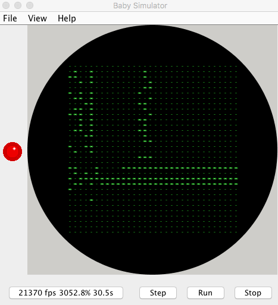
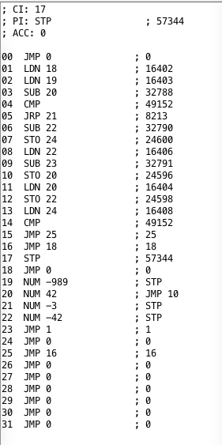

# Manchester Baby Architecture

A full breakdown on the Manchester Baby's architecture can be found in the Wikipedia article above as well as several PDFs, all of which can be found online. The following is meant as a brief overview to present some background to the Python code that will be discussed later.

## Storage Lines

Baby used 32-bit words with numbers represented in [twos complement form](https://en.wikipedia.org/wiki/Two's_complement). The words were stored in *store lines* with the least significant bit (LSB) first (to the left of the word). This is the reverse of most modern computer architectures where the LSB is held in the right most position.

The storage lines are equivalent to memory in modern computers. Each storage line contains a 32-bit value and the value could represent an instruction or data. When used as an instruction, the storage line is interpreted as follows:

| Bits  | Description                          |
|-------|--------------------------------------|
| 0–5   | Storage line number to be operated on |
| 6–12  | Not used                             |
| 13–15 | Opcode                               |
| 16–31 | Not used                             |

As already noted, when the storage line is interpreted as data then the storage line contains a 32-bit number stored in twos complement form with the LSB to the left and the most significant bit (MSB) to the right.

This mixing of data and program in the same memory is known as von Neumann architecture named after [John von Neumann](https://en.wikipedia.org/wiki/John_von_Neumann). For those who are interested, the memory architecture where program and data are stored in separate storage areas is known as a [Harvard architecture](https://en.wikipedia.org/wiki/Harvard_architecture).

## SSEM Instruction Set

Baby used three bits for the instruction opcode, bits 13, 14 and 15 in each 32 bit word. This gave a maximum of 8 possible instructions. In fact, only seven were implemented.

| Binary Code | Mnemonic | Description |
|-------------|----------|-------------|
| 000         | JMP S    | Jump to the address obtained from memory address S (absolute jump) |
| 100         | JRP S    | Add the value in store line S to the program counter (relative jump) |
| 010         | LDN S    | Load the accumulator with the negated value in store line S |
| 110         | STO S    | Store the accumulator into store line S |
| 001 or 101  | SUB S    | Subtract the contents of store line S from the accumulator |
| 011         | CMP      | If the accumulator is negative then add 1 to the program counter (i.e. skip the next instruction) |
| 111         | STOP     | Stop the program |

When reading the above table it is important to remember that the LSB is to the left.

## Registers

Baby had three storage areas within the CPU:

1. Current Instruction (CI)
2. Present Instruction (PI)
3. Accumulator

The current instruction is the modern day equivalent of the program counter. This contains the address of the instruction currently executing. CI is incremented before the instruction is fetched from memory. At startup, CI is loaded with the value 0. This means that the first instruction fetched from memory for execution is the instruction in storage line 1.

The present instruction (PI) is the actual instruction that is currently being executed.

As with modern architecture, the accumulator is used as a working store containing the results of any calculations.


## Testing

Testing the application was going to be tricky without a reference. Part of the reason for developing the Python implementation was to check my understanding of the operation of the SSEM. Luckily, David Sharp has developed an [emulator](http://www.davidsharp.com/riscos/index.html) written in Java. I can use this to check the results of the Python code.

The original test program run on the Manchester Baby was a calculation of factors. This was used as it would stress the machine. This same application can be found in several online samples and will be used as the test application for the simulator. The program is as follows:

```
--
--  Tom Kilburns Highest Common Factor for 989
--
01:   LDN 18
02:   LDN 19
03:   SUB 20
04:   CMP
05:   JRP 21
06:   SUB 22
07:   STO 24
08:   LDN 22
09:   SUB 23
10:   STO 20
11:   LDN 20
12:   STO 22
13:   LDN 24
14:   CMP
15:   JMP 25
16:   JMP 18
17:   STOP
18:   NUM 0
19:   NUM -989
20:   NUM 988
21:   NUM -3
22:   NUM -988
23:   NUM 1
24:   NUM 0
25:   NUM 16
```

### Running on the Java Emulator

Executing the above code in David Sharps emulator gives the following output on the storage tube:



and disassembler view:



### Running on the [M5Stack Tab5](https://docs.m5stack.com/en/core/Tab5)

Running the program on the Tab5 and recording the output on the serial port shows the following:

```
I (41565) Tab5SSEM: Program execution completed, Elapsed time=19.16 seconds
I (41565) Tab5SSEM: CPU execution stopped after 21,387 instructions.
I (41575) Tab5SSEM:                    00000000001111111111222222222233
I (41575) Tab5SSEM:                    01234567890123456789012345678901
I (41575) Tab5SSEM:    0: 0x00000000 - 00000000000000000000000000000000 JMP 0            ; 0
I (41585) Tab5SSEM:    1: 0x48020000 - 01001000000000100000000000000000 LDN 18           ; 16402
I (41595) Tab5SSEM:    2: 0xc8020000 - 11001000000000100000000000000000 LDN 19           ; 16403
I (41605) Tab5SSEM:    3: 0x28010000 - 00101000000000010000000000000000 SUB 20           ; 32788
I (41615) Tab5SSEM:    4: 0x00030000 - 00000000000000110000000000000000 CMP              ; 49152
I (41625) Tab5SSEM:    5: 0xa8040000 - 10101000000001000000000000000000 JPR 21           ; 8213
I (41625) Tab5SSEM:    6: 0x68010000 - 01101000000000010000000000000000 SUB 22           ; 32790
I (41635) Tab5SSEM:    7: 0x18060000 - 00011000000001100000000000000000 STO 24           ; 24600
I (41645) Tab5SSEM:    8: 0x68020000 - 01101000000000100000000000000000 LDN 22           ; 16406
I (41655) Tab5SSEM:    9: 0xe8010000 - 11101000000000010000000000000000 SUB 23           ; 32791
I (41665) Tab5SSEM:   10: 0x28060000 - 00101000000001100000000000000000 STO 20           ; 24596
I (41675) Tab5SSEM:   11: 0x28020000 - 00101000000000100000000000000000 LDN 20           ; 16404
I (41685) Tab5SSEM:   12: 0x68060000 - 01101000000001100000000000000000 STO 22           ; 24598
I (41685) Tab5SSEM:   13: 0x18020000 - 00011000000000100000000000000000 LDN 24           ; 16408
I (41695) Tab5SSEM:   14: 0x00030000 - 00000000000000110000000000000000 CMP              ; 49152
I (41705) Tab5SSEM:   15: 0x98000000 - 10011000000000000000000000000000 JMP 25           ; 25
I (41715) Tab5SSEM:   16: 0x48000000 - 01001000000000000000000000000000 JMP 18           ; 18
I (41725) Tab5SSEM:   17: 0x00070000 - 00000000000001110000000000000000 HALT             ; 57344
I (41735) Tab5SSEM:   18: 0x00000000 - 00000000000000000000000000000000 JMP 0            ; 0
I (41735) Tab5SSEM:   19: 0xc43fffff - 11000100001111111111111111111111 HALT             ; -989
I (41745) Tab5SSEM:   20: 0x54000000 - 01010100000000000000000000000000 JMP 10           ; 42
I (41755) Tab5SSEM:   21: 0xbfffffff - 10111111111111111111111111111111 HALT             ; -3
I (41765) Tab5SSEM:   22: 0x6bffffff - 01101011111111111111111111111111 HALT             ; -42
I (41775) Tab5SSEM:   23: 0x80000000 - 10000000000000000000000000000000 JMP 1            ; 1
I (41785) Tab5SSEM:   24: 0x00000000 - 00000000000000000000000000000000 JMP 0            ; 0
I (41785) Tab5SSEM:   25: 0x08000000 - 00001000000000000000000000000000 JMP 16           ; 16
I (41795) Tab5SSEM:   26: 0x00000000 - 00000000000000000000000000000000 JMP 0            ; 0
I (41805) Tab5SSEM:   27: 0x00000000 - 00000000000000000000000000000000 JMP 0            ; 0
I (41815) Tab5SSEM:   28: 0x00000000 - 00000000000000000000000000000000 JMP 0            ; 0
I (41825) Tab5SSEM:   29: 0x00000000 - 00000000000000000000000000000000 JMP 0            ; 0
I (41835) Tab5SSEM:   30: 0x00000000 - 00000000000000000000000000000000 JMP 0            ; 0
I (41835) Tab5SSEM:   31: 0x00000000 - 00000000000000000000000000000000 JMP 0            ; 0
```

Examination of the output shows that the applications have resulted in the same output. Note that the slight variation in the final output of the simulator code is due to the way in which numbers are extracted from the registers. Examination of the bit patterns in the store lines shows that the Java and C++ simulator resulted in the same values.

## Conclusion

The Baby presented an ideal way to start to examine computer architecture due to its primitive nature. The small storage space and simple instruction set allowed emulation in only a few lines of code.
