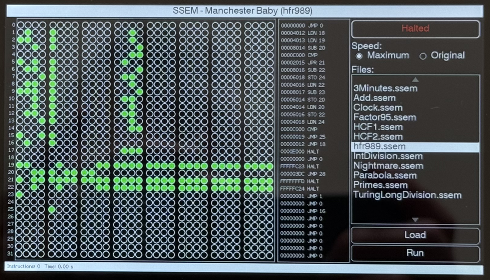

# Small Scale Experimentation Machine (SSEM) - The Manchester Baby

[](https://github.com/NevynUK/Tab5SSEM/actions/workflows/run-code-checks.yml)

[](https://github.com/NevynUK/Tab5SSEM/actions/workflows/build.yml)

The [Manchester Small Scale Experimental Machine (SSEM)](https://en.wikipedia.org/wiki/Manchester_Small-Scale_Experimental_Machine) or Manchester Baby as it became known, was the first computer capable of executing a stored program. Baby was meant as a proving ground for the early computer technology having only 32 words of memory and a small instruction set.

A replica of the original Manchester Baby is currently on show in the [Museum of Science and Industry](http://www.msimanchester.org.uk/) in Castlefield, Manchester.


As you can see, it is a large machine weighing in at over 1 ton (that's imperial, not metric, hence the spelling).

This repository contains a C++ emulator that will run on the [M5Stack Tab5](https://docs.m5stack.com/en/core/Tab5).  The emulator provides the following features:

- Touch interface using the LCD on the Tab 5
- Serial feedback over USB-C
- Compiler and disassembler to read programs on the SD Card

## Running the Application

The default application consists of a splash screen and a touch test application.

### Splash Screen

On startup the application displays a simple splash screen, tap on the splash screen to move on to the simulator.

### User Interface



The user interface has three main components:

- Numbered store lines
- Disassembled store lines
- Control Panel

### Control Panel

The control panel shows the state of the simulator as well as enabling the simulator to be controlled.

#### Simulator State

This shows the state of the simulator, it will show either *Halted* or *Running*.

#### Simulation Speed

The simulator can run at two speeds, *maximum* and *original*.  Maximum speed runs the application as fast as possible.  This is about 1,200 instructions per second.

Original speed runs at 1,000 instructions per second.  This compares to the original SSEM speed of 700 to 1,200 instructions per second.

#### File List

This is the list of files on the SD Card.  The *Load* button will be enabled when a file name is selected.

#### Load and Run Buttons

The *Load* button loads the selected application into the store lines.  The LED indicators and the Disassembly section will be updated accordingly.

The application can be executed by pressing the *Run* button.  This will also disable the speed selection, file selection and *Load* button / controls.

## Serial Output

The simulator gives logging and debug feedback using the ESP-IDF logging framework.  This is present on the USB-C interface.  Sample output for the *hrf989.ssem application is as follows:

```
I (22405) Tab5SSEM: Program loaded, starting execution
I (22405) Tab5SSEM:                    00000000001111111111222222222233
I (22415) Tab5SSEM:                    01234567890123456789012345678901
I (22415) Tab5SSEM:    0: 0x00000000 - 00000000000000000000000000000000 JMP 0            ; 0
I (22425) Tab5SSEM:    1: 0x48020000 - 01001000000000100000000000000000 LDN 18           ; 16402
I (22435) Tab5SSEM:    2: 0xc8020000 - 11001000000000100000000000000000 LDN 19           ; 16403
I (22445) Tab5SSEM:    3: 0x28010000 - 00101000000000010000000000000000 SUB 20           ; 32788
I (22455) Tab5SSEM:    4: 0x00030000 - 00000000000000110000000000000000 CMP              ; 49152
I (22455) Tab5SSEM:    5: 0xa8040000 - 10101000000001000000000000000000 JPR 21           ; 8213
I (22465) Tab5SSEM:    6: 0x68010000 - 01101000000000010000000000000000 SUB 22           ; 32790
I (22475) Tab5SSEM:    7: 0x18060000 - 00011000000001100000000000000000 STO 24           ; 24600
I (22485) Tab5SSEM:    8: 0x68020000 - 01101000000000100000000000000000 LDN 22           ; 16406
I (22495) Tab5SSEM:    9: 0xe8010000 - 11101000000000010000000000000000 SUB 23           ; 32791
I (22505) Tab5SSEM:   10: 0x28060000 - 00101000000001100000000000000000 STO 20           ; 24596
I (22515) Tab5SSEM:   11: 0x28020000 - 00101000000000100000000000000000 LDN 20           ; 16404
I (22515) Tab5SSEM:   12: 0x68060000 - 01101000000001100000000000000000 STO 22           ; 24598
I (22525) Tab5SSEM:   13: 0x18020000 - 00011000000000100000000000000000 LDN 24           ; 16408
I (22535) Tab5SSEM:   14: 0x00030000 - 00000000000000110000000000000000 CMP              ; 49152
I (22545) Tab5SSEM:   15: 0x98000000 - 10011000000000000000000000000000 JMP 25           ; 25
I (22555) Tab5SSEM:   16: 0x48000000 - 01001000000000000000000000000000 JMP 18           ; 18
I (22565) Tab5SSEM:   17: 0x00070000 - 00000000000001110000000000000000 HALT             ; 57344
I (22565) Tab5SSEM:   18: 0x00000000 - 00000000000000000000000000000000 JMP 0            ; 0
I (22575) Tab5SSEM:   19: 0xc43fffff - 11000100001111111111111111111111 HALT             ; -989
I (22585) Tab5SSEM:   20: 0x3bc00000 - 00111011110000000000000000000000 JMP 28           ; 988
I (22595) Tab5SSEM:   21: 0xbfffffff - 10111111111111111111111111111111 HALT             ; -3
I (22605) Tab5SSEM:   22: 0x243fffff - 00100100001111111111111111111111 HALT             ; -988
I (22615) Tab5SSEM:   23: 0x80000000 - 10000000000000000000000000000000 JMP 1            ; 1
I (22615) Tab5SSEM:   24: 0x00000000 - 00000000000000000000000000000000 JMP 0            ; 0
I (22625) Tab5SSEM:   25: 0x08000000 - 00001000000000000000000000000000 JMP 16           ; 16
I (22635) Tab5SSEM:   26: 0x00000000 - 00000000000000000000000000000000 JMP 0            ; 0
I (22645) Tab5SSEM:   27: 0x00000000 - 00000000000000000000000000000000 JMP 0            ; 0
I (22655) Tab5SSEM:   28: 0x00000000 - 00000000000000000000000000000000 JMP 0            ; 0
I (22655) Tab5SSEM:   29: 0x00000000 - 00000000000000000000000000000000 JMP 0            ; 0
I (22665) Tab5SSEM:   30: 0x00000000 - 00000000000000000000000000000000 JMP 0            ; 0
I (22675) Tab5SSEM:   31: 0x00000000 - 00000000000000000000000000000000 JMP 0            ; 0
I (41565) Tab5SSEM: Program execution completed, Elapsed time=19.16 seconds
I (41565) Tab5SSEM: CPU execution stopped after 21,387 instructions.
I (41575) Tab5SSEM:                    00000000001111111111222222222233
I (41575) Tab5SSEM:                    01234567890123456789012345678901
I (41575) Tab5SSEM:    0: 0x00000000 - 00000000000000000000000000000000 JMP 0            ; 0
I (41585) Tab5SSEM:    1: 0x48020000 - 01001000000000100000000000000000 LDN 18           ; 16402
I (41595) Tab5SSEM:    2: 0xc8020000 - 11001000000000100000000000000000 LDN 19           ; 16403
I (41605) Tab5SSEM:    3: 0x28010000 - 00101000000000010000000000000000 SUB 20           ; 32788
I (41615) Tab5SSEM:    4: 0x00030000 - 00000000000000110000000000000000 CMP              ; 49152
I (41625) Tab5SSEM:    5: 0xa8040000 - 10101000000001000000000000000000 JPR 21           ; 8213
I (41625) Tab5SSEM:    6: 0x68010000 - 01101000000000010000000000000000 SUB 22           ; 32790
I (41635) Tab5SSEM:    7: 0x18060000 - 00011000000001100000000000000000 STO 24           ; 24600
I (41645) Tab5SSEM:    8: 0x68020000 - 01101000000000100000000000000000 LDN 22           ; 16406
I (41655) Tab5SSEM:    9: 0xe8010000 - 11101000000000010000000000000000 SUB 23           ; 32791
I (41665) Tab5SSEM:   10: 0x28060000 - 00101000000001100000000000000000 STO 20           ; 24596
I (41675) Tab5SSEM:   11: 0x28020000 - 00101000000000100000000000000000 LDN 20           ; 16404
I (41685) Tab5SSEM:   12: 0x68060000 - 01101000000001100000000000000000 STO 22           ; 24598
I (41685) Tab5SSEM:   13: 0x18020000 - 00011000000000100000000000000000 LDN 24           ; 16408
I (41695) Tab5SSEM:   14: 0x00030000 - 00000000000000110000000000000000 CMP              ; 49152
I (41705) Tab5SSEM:   15: 0x98000000 - 10011000000000000000000000000000 JMP 25           ; 25
I (41715) Tab5SSEM:   16: 0x48000000 - 01001000000000000000000000000000 JMP 18           ; 18
I (41725) Tab5SSEM:   17: 0x00070000 - 00000000000001110000000000000000 HALT             ; 57344
I (41735) Tab5SSEM:   18: 0x00000000 - 00000000000000000000000000000000 JMP 0            ; 0
I (41735) Tab5SSEM:   19: 0xc43fffff - 11000100001111111111111111111111 HALT             ; -989
I (41745) Tab5SSEM:   20: 0x54000000 - 01010100000000000000000000000000 JMP 10           ; 42
I (41755) Tab5SSEM:   21: 0xbfffffff - 10111111111111111111111111111111 HALT             ; -3
I (41765) Tab5SSEM:   22: 0x6bffffff - 01101011111111111111111111111111 HALT             ; -42
I (41775) Tab5SSEM:   23: 0x80000000 - 10000000000000000000000000000000 JMP 1            ; 1
I (41785) Tab5SSEM:   24: 0x00000000 - 00000000000000000000000000000000 JMP 0            ; 0
I (41785) Tab5SSEM:   25: 0x08000000 - 00001000000000000000000000000000 JMP 16           ; 16
I (41795) Tab5SSEM:   26: 0x00000000 - 00000000000000000000000000000000 JMP 0            ; 0
I (41805) Tab5SSEM:   27: 0x00000000 - 00000000000000000000000000000000 JMP 0            ; 0
I (41815) Tab5SSEM:   28: 0x00000000 - 00000000000000000000000000000000 JMP 0            ; 0
I (41825) Tab5SSEM:   29: 0x00000000 - 00000000000000000000000000000000 JMP 0            ; 0
I (41835) Tab5SSEM:   30: 0x00000000 - 00000000000000000000000000000000 JMP 0            ; 0
I (41835) Tab5SSEM:   31: 0x00000000 - 00000000000000000000000000000000 JMP 0            ; 0
```