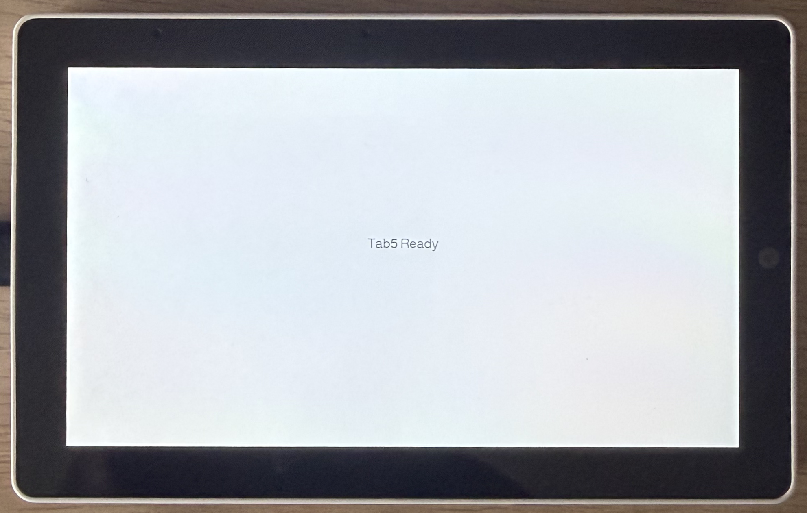
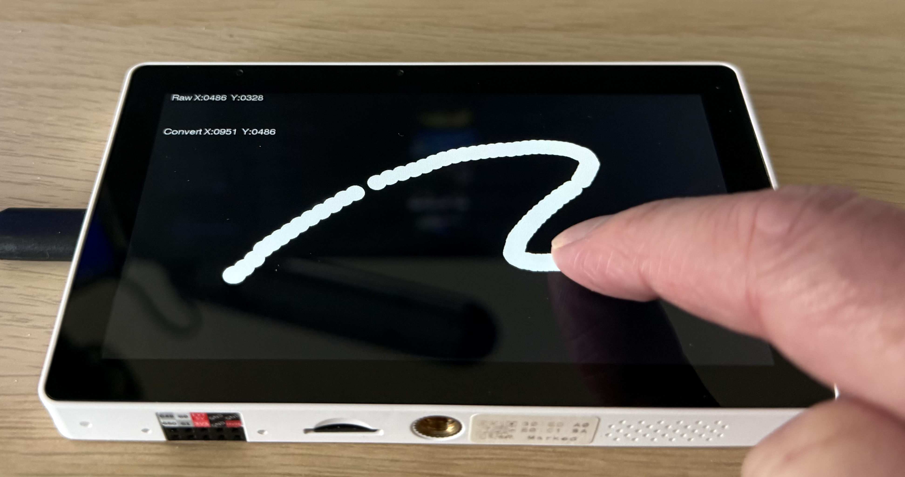

# Tab5Template

Template application for the [M5Stack Tab5](https://docs.m5stack.com/en/core/Tab5) development platform.

## Running the Application

The default application consists of a splash screen and a touch test application.

### Splash Screen

On startup the application displays the following splash screen:

Tap on the splash screen to move on to the touch screen test.

### Touch Screen Test

The screen will turn black after the splash screen has been dismissed.  Touch the screen and move your finger over the display.  The test application will follow your finger and display a trace of the path taken.  The screen coordinates will also be shown on the display.

Removing your finger from the display will cause the screen to revert to a black screen.  Touching the screen again will allow you to draw on the screen.
